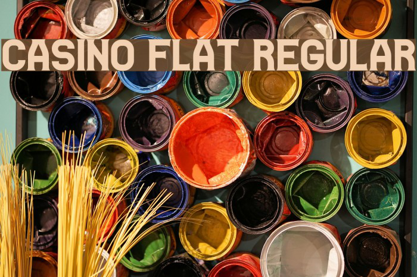
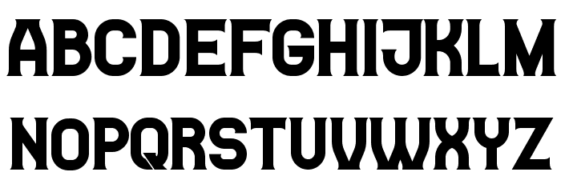

# Casino

A casino is a facility for certain types of gambling. Casinos are often built near or combined with hotels, resorts, restaurants, retail shops, cruise ships, and other tourist attractions. Some casinos are also known for hosting live entertainment, such as stand-up comedy, concerts, and sports.

## Variable Font Axe

Casino has the following axe:

Axis | Tag | Default | Static Instances
--- | --- | --- | ---
Weight | wght | 400 | Regular

## License

This Font Software is licensed under the SIL Open Font License, Version 1.1.
This license is available with a FAQ at [https://openfontlicense.org](https://openfontlicense.org)

